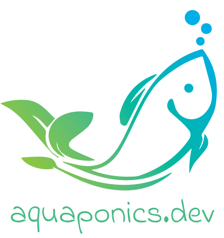

Host your second brain and [digital garden](https://jzhao.xyz/posts/networked-thought) for free. Quartz features

Testing out connection to obsidian
[[ceroziFulvicAcidIncreases2020 - Extracted Annotations]]

1. zotero [[zotero/abusinSustainableFoodProduction2020 - Extracted Annotations]]
2. website[LorenaSA.com](https://lorenasa.com)

   
  test without wikilinks [ceroziFulvicAcidIncreases2020 - Extracted Annotations](ceroziFulvicAcidIncreases2020%20-%20Extracted%20Annotations.md)
  test image without wikilinks [Drawing 2022-08-10 22.45.00.excalidraw](Drawing%202022-08-10%2022.45.00.excalidraw.md)

absolute path [Drawing 2022-07-22 06.03.32.excalidraw](Excalidraw/Drawing%202022-07-22%2006.03.32.excalidraw.md)

1. Extremely fast natural-language [[notes/search]]
2. Customizable and hackable design based on [Hugo](https://gohugo.io/)
3. Automatically generated backlinks, link previews, and local graph
4. Built-in [[notes/CJK + Latex Support (测试) | CJK + Latex Support]] and [[notes/callouts | Admonition-style callouts]]
5. Support for both Markdown Links and Wikilinks

Check out some of the [amazing gardens that community members](notes/showcase.md) have published with Quartz or read about [why I made Quartz](notes/philosophy.md) to begin with.

## Get Started
> 📚 Step 1: [Setup your own digital garden using Quartz](notes/setup.md)

Returning user? Figure out how to [[notes/updating|update]] your existing Quartz garden.

If you prefer browsing the contents of this site through a list instead of a graph, you see a list of all [setup-related notes](/tags/setup).

### Troubleshooting
- 🚧 [Troubleshooting and FAQ](notes/troubleshooting.md)
- 🐛 [Submit an Issue](https://github.com/jackyzha0/quartz/issues)
- 👀 [Discord Community](https://discord.gg/cRFFHYye7t)

