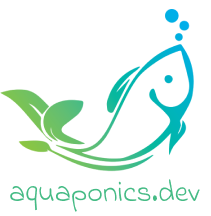

Hi! My name is Lorena. Welcome to my digital garden. I am a PhD student at [Wageningen](https://www.wur.nl/en/about-wur.htm) working on making a tool to calculate the Return of Investment of Aquaponics endeavors. If you´d like to see more about me you can go visit my personal website [LorenaSA.com](https://lorenasa.com).

Even before I started my PhD I have been researching a lot about aquaponics and adjacent topics, I have ingested over a thousand articles, papers, books and videos. It is always hard to find what you want to find, either because it is bad quality, or it is not open access or even because there is just too much mess. When my reading started getting too messy I figured I needed a system to organize it and came across the concept of digital garden, personal knowledge management (PKM), zettelkasten, Zotero and Obsidian. With this in mind, I started cataloguing my notes and wondered how many other people have done the same, searched for specific literature related to specific topics. I figured I should put it out there so other people can start from a step above what I started. 

> [!tip] Why this page 
>
>This page is intended to share my notes on aquaponics and its adjacent subject (which are a lot!). Do not expect a perfect order but a review of my takes on each article I digest, the classifications I deem important for my reasearch and my personal take on the article itself. 

## Get Started

I have classified my notes into a way I find helpful (not necessarily the best way for all).

Here it is:

- [[Fish]]
	- [[Species]]
		- [[Tilapia]]
		- [Fish/Species/Rainbow Trout](Fish/Species/Rainbow%20Trout)
- [[Plant]]
- [[Bacteria]]

This page is intended to share my notes on aquaponics and its adjacent subject (which are a lot!).
Host your second brain and [digital garden](https://jzhao.xyz/posts/networked-thought) for free. Quartz features

Testing out connection to obsidian
[[ceroziFulvicAcidIncreases2020 - Extracted Annotations]]

1. zotero [[zotero/abusinSustainableFoodProduction2020 - Extracted Annotations]]
2. website[LorenaSA.com](https://lorenasa.com)

   
  test without wikilinks [ceroziFulvicAcidIncreases2020 - Extracted Annotations](ceroziFulvicAcidIncreases2020%20-%20Extracted%20Annotations.md)
  test image without wikilinks [Drawing 2022-08-10 22.45.00.excalidraw](Drawing%202022-08-10%2022.45.00.excalidraw.md)

absolute path [Drawing 2022-07-22 06.03.32.excalidraw](Excalidraw/Drawing%202022-07-22%2006.03.32.excalidraw.md)

1. Extremely fast natural-language [[notes/search]]
2. Customizable and hackable design based on [Hugo](https://gohugo.io/)
3. Automatically generated backlinks, link previews, and local graph
4. Built-in [[notes/CJK + Latex Support (测试) | CJK + Latex Support]] and [[notes/callouts | Admonition-style callouts]]
5. Support for both Markdown Links and Wikilinks

Check out some of the [amazing gardens that community members](notes/showcase.md) have published with Quartz or read about [why I made Quartz](notes/philosophy.md) to begin with.

## Get Started
> 📚 Step 1: [Setup your own digital garden using Quartz](notes/setup.md)

Returning user? Figure out how to [[notes/updating|update]] your existing Quartz garden.

If you prefer browsing the contents of this site through a list instead of a graph, you see a list of all [setup-related notes](/tags/setup).

### Troubleshooting
- 🚧 [Troubleshooting and FAQ](notes/troubleshooting.md)
- 🐛 [Submit an Issue](https://github.com/jackyzha0/quartz/issues)
- 👀 [Discord Community](https://discord.gg/cRFFHYye7t)

''' dataview
LIST
'''
